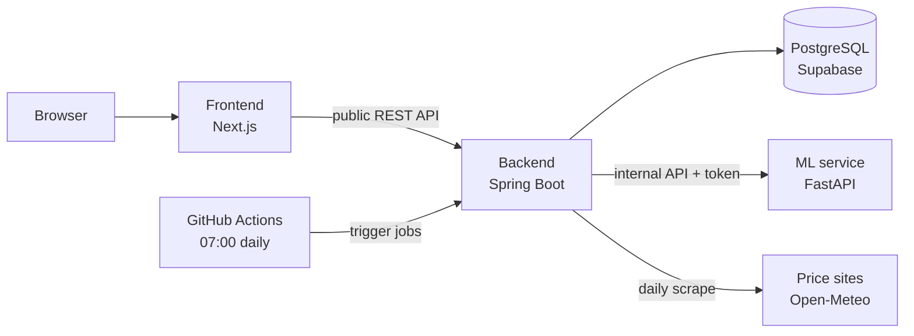

# Pepper Price Forecasting Platform

[](https://github.com/DungK5UIT/Pepper-Price-Forecasting-PlatForm/actions/workflows/ci.yml)

**Live demo:** <https://pepper-price-forecasting-plat-form.vercel.app> —
hosted on free tiers, so the first load after a quiet spell can take up to a
minute while the backend wakes.

A three-service platform that collects the daily domestic price of
Vietnamese black pepper (tiêu) and the weather in its growing provinces, and
publishes a short-term price forecast with an honest uncertainty band.

Built as a production-style engineering project: every significant decision
is recorded, requirements are traced to tests, and the gaps are written down
rather than hidden.

> **Tóm tắt:** Nền tảng dự báo giá tiêu Việt Nam — tự thu thập giá hằng ngày
> từ hai nguồn công khai và thời tiết 6 tỉnh trồng tiêu, lưu lịch sử từ 2005,
> dự báo theo ngày/tuần/tháng kèm khoảng tin cậy. Next.js + Spring Boot +
> FastAPI + PostgreSQL, CI trên GitHub Actions.

## What it does

- **Collects** the price every morning from two public sites, cross-checks
  them, and refuses a page that no longer parses instead of storing garbage.
- **Collects** 7-day weather for six provinces from Open-Meteo.
- **Forecasts** the price by day, week and month as a median with a 10–90%
  band, and serves it through a public read-only API and a two-page website.

## Architecture



- The **backend** is the system of record: schema (Flyway), public API,
  access control, data collection and forecast orchestration.
- The **ML service** is stateless and has no database access; the backend
  sends it history and stores what it returns ([ADR-0003](docs/adr/0003-ml-service-data-access.md)).
- The **frontend** renders on the server and talks only to the backend.

Detail: [architecture overview](docs/architecture/overview.md),
[domain model](docs/architecture/domain-model.md).

## Engineering highlights

- **The simple model ships because it measures better.** Every training run
  backtests a gradient-boosting model against a naive random walk on 261
  months of history. The baseline wins (mean pinball loss 2,146 vs 2,401 đ,
  10–90 band coverage 0.83 vs 0.64), so the baseline is what users see
  ([ADR-0004](docs/adr/0004-forecasting-model.md)).
- **Decisions are written down, including the ones that were reversed.**
  Eight ADRs; the Fly.io deployment plan is kept as *superseded* next to the
  Render plan that replaced it ([docs/adr](docs/adr/)).
- **Data collection is built to fail loudly.** Two sources read on every run,
  a plausibility gate on every price, idempotent writes, a log of every
  attempt and a `STALE` health status when a job goes quiet
  ([ADR-0005](docs/adr/0005-data-ingestion.md)).
- **Security sized to the system.** An open read-only API, one machine
  credential for internal endpoints, no default secrets — services refuse to
  start without them ([ADR-0006](docs/adr/0006-internal-api-access.md)).
- **Correct dates on any host.** "Today" is a Vietnamese trading day, pinned
  through an injected clock, not the container's UTC.
- **Requirements traced to tests.** [35 functional requirements](docs/requirements.md)
  map to [73 test cases](docs/test-cases.md) — 43 covered, the rest named as
  gaps, with a [risk register](docs/risks.md) ranking what to fix first.

## Tech stack

| Layer | Technology |
|---|---|
| Frontend | Next.js 16, React 19, TypeScript, Tailwind CSS 4 |
| Backend | Java 21, Spring Boot 4.1, Spring Data JPA, Spring Security, Flyway |
| ML service | Python 3.13, FastAPI, pandas, NumPy, scikit-learn |
| Data | PostgreSQL (Supabase) |
| Delivery | Docker, Docker Compose, GitHub Actions, Render, Vercel |

## Quick start

Needs Docker, a PostgreSQL database (the project uses Supabase; Flyway
creates the schema on first start) and two generated secrets
(`openssl rand -base64 32`).

```bash
cp infra/docker/.env.example infra/docker/.env      # fill in the values
docker compose -f infra/docker/compose.yaml --env-file infra/docker/.env up --build
```

Open <http://localhost:3000>. To load today's data immediately, see
"Daily schedule" in the [setup guide](docs/development/setup.md), which also
covers running each service on its own.

## Tests

```bash
cd backend    && ./mvnw test      # 55 tests — JUnit 5, Spring slices, H2
cd ml-service && pytest           # 21 tests
cd frontend   && npm run lint && npm run build
```

CI runs all three on every push and pull request. What each test verifies,
and what is not tested yet: [docs/test-cases.md](docs/test-cases.md).

## Repository layout

```
frontend/     Next.js app
backend/      Spring Boot service (migrations in src/main/resources/db/migration)
ml-service/   FastAPI service, training CLI, trained model artifact
infra/        Docker Compose (local) and Render Blueprint (hosted)
docs/         requirements, test cases, risks, ADRs, API, database, architecture
.github/      CI and the daily job schedule
```

## Documentation

| Document | What it answers |
|---|---|
| [Requirements](docs/requirements.md) | What must the system do, for whom, how well? |
| [Test cases](docs/test-cases.md) | Which test proves each requirement, and what is missing? |
| [Risks](docs/risks.md) | What can go wrong, and what is being done about it? |
| [ADRs](docs/adr/) | Why is it built this way? |
| [API](docs/api/README.md) | The public API contract |
| [Database](docs/database/README.md) | Tables and where their data comes from |
| [Setup](docs/development/setup.md) | How to run and test everything locally |
| [Contributing](CONTRIBUTING.md) | Workflow, coding rules, commit conventions |
| [Changelog](CHANGELOG.md) | What changed, by milestone |

## Status and next steps

All three services are deployed — the frontend on Vercel, the backend and
ML service on Render, PostgreSQL on Supabase — and run on data collected
every morning. Next, in order ([risk register](docs/risks.md)):

1. Add a timeout to every outbound call (RISK-02).
2. Test the calculations behind the public numbers and measure coverage (RISK-05).
3. Fix the monthly forecast dates (RISK-04) and decide whether the market
   commentary is generated or removed (OQ-1).

Development is AI-assisted under a written workflow — see
[CONTRIBUTING.md](CONTRIBUTING.md); commits made with an AI model say so.
