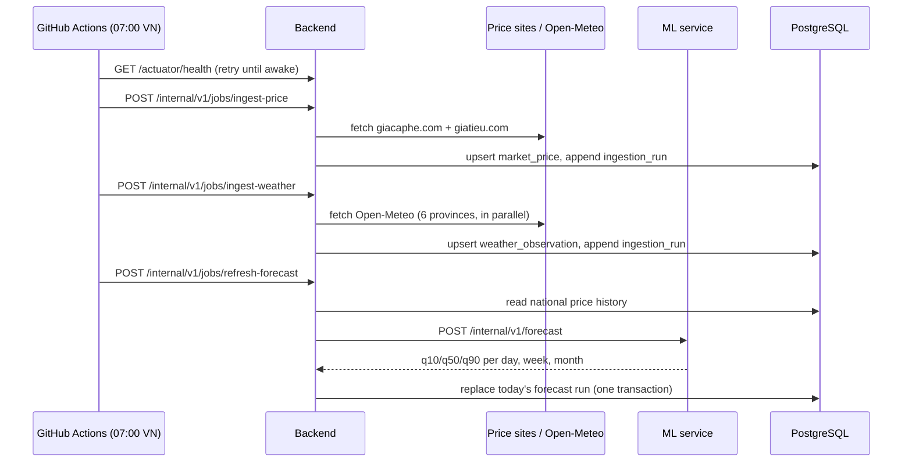
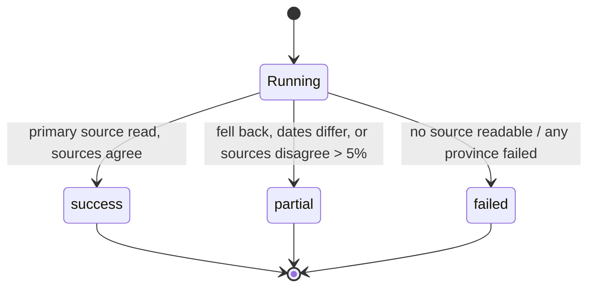

# Requirements

| Version | Date | Change |
|---|---|---|
| 1.0 | 2026-09-30 | First version, reverse-engineered from the running system at commit `c0ad2f0` and the ADRs. |

## 1. Introduction

Vietnamese black pepper (tiêu) is quoted daily, per growing region, on a
handful of public websites. Growers and traders read the number but get no
sense of where it is heading or how uncertain that is. This platform collects
the daily domestic price and the weather in the growing provinces, keeps the
history, and publishes a short-term forecast with an honest uncertainty band.

This document states what the system must do. It was written after the first
vertical slice was built, by reading the code, the tests and the ADRs, so it
records the system as it is **and** marks where it falls short. Rows marked
**Gap** are behaviour the system should have and does not yet; each one has a
matching entry in [`risks.md`](risks.md). Test coverage for every requirement
is traced in [`test-cases.md`](test-cases.md).

**In scope:** daily price and weather collection, storage, forecasting, a
public read-only API and a two-page website.
**Out of scope (for now):** user accounts, alerts to users, export
markets/world prices, macro inputs (CPI, FX) to the model.

## 2. Actors, roles and permissions

| Actor | Kind | Can do | How it authenticates |
|---|---|---|---|
| Visitor | Person (grower, trader) | Read the website and `GET /api/**`; see the aggregate `/actuator/health` status | None — public read-only data |
| Scheduler | GitHub Actions workflow | Trigger `POST /internal/v1/jobs/*` once a day | HTTP Basic, role `INTERNAL` |
| Operator | Project owner | Run model training; read the per-component health detail | HTTP Basic, role `INTERNAL` |
| Backend | Service | Read/write the database; call the ML service | DB credentials; `X-Internal-Token` to the ML service |
| ML service | Service | Compute forecasts on request | Checks `X-Internal-Token`; no DB access (ADR-0003) |
| Supabase `anon` / `authenticated` | DB roles | Nothing | Row Level Security enabled with no policies |

## 3. State flows

### 3.1 Daily cycle

### 3.2 Collection run status

A `partial` run still stored the day's data. Only `failed` stored nothing.

### 3.3 Weather observation

A date first arrives as a **forecast** (after today) and is overwritten as an
**observation** once it has passed (each run also re-reads yesterday).

### 3.4 Forecast run

One run per `as_of_date`. Re-running on the same day replaces that day's run.
Older runs are kept; only the latest is served.

### 3.5 Data freshness health

`UP` ⇄ `STALE`: `STALE` while any collection job has had no non-failed run in
the last 26 hours.

## 4. Functional requirements

### Public API — `/api/v1` (contract: [`api/README.md`](api/README.md))

| ID | The system shall… | Source |
|---|---|---|
| FR-01 | `GET /prices/today`: return the latest national price (VND/kg), its change against the previous observation (VND and %, 1 decimal), the as-of date (`dd/MM`, latest observed date) and a range (q10/q50/q90) from the latest daily forecast point closest to 7 days after it. No forecast yet → the range equals the price. | `DatabasePriceService` |
| FR-02 | `GET /prices/regions`: return the latest price per region with its change against that region's previous observation, sorted by region name. | `DatabasePriceService` |
| FR-03 | `GET /prices/forecast?granularity=day\|week\|month` (default `day`): return history averaged into buckets (15 days / 10 ISO weeks / 12 months) followed by the latest forecast run (14 / 8 / 6 points). The last history point is marked `isToday` and carries both the actual value and equal quantiles. Any other granularity → `400`. | `DatabasePriceService`, `Granularity` |
| FR-04 | `GET /prices/stats`: return the change over 30, 90 and 365 days against the latest observation on or before each cutoff; `0` when there is none. | `DatabasePriceService` |
| FR-05 | `GET /weather`: per province, today (VN date) and up to 6 following days; first day labelled "Hôm nay", then weekday labels; condition derived from rain and wind (≥ 10 mm → `cloud-rain`, wind ≥ 25 km/h → `wind`, ≥ 3 mm → `cloud`, ≥ 0.5 mm → `cloud-sun`, else `sun`). | `DatabaseWeatherService` |
| FR-06 | `GET /market-insight`: return the latest commentary text and its `dd/MM` date. | `DatabaseMarketInsightService` |
| FR-07 | Follow the API conventions: JSON only, money as whole VND integers, optional fields omitted, errors as RFC 9457 problem details, `GET` only, unknown path `404`, any write `401`. | `GlobalExceptionHandler`, `SecurityConfig` |

### Price collection (ADR-0005)

| ID | The system shall… | Source |
|---|---|---|
| FR-08 | Once per trading day, read the domestic price page of giacaphe.com (primary) and giatieu.com (fallback) — both, every run. | `PriceIngestionService` |
| FR-09 | Refuse a page with no recognisable price rows, or with any price outside 10,000–1,000,000 VND/kg, as a layout change. | `HtmlPriceSource` |
| FR-10 | Store the first readable source. Mark the run `partial` when it fell back, when the two sources are dated differently, or when their national averages differ by more than 5%. | `PriceIngestionService` |
| FR-11 | Store each region's price plus a `national` price (mean of the regions, 2 d.p.) for the page's date, idempotently on (commodity, region, date); the source is recorded as provenance, not identity. | `MarketPriceStore` |
| FR-12 | When no source can be read: record a `failed` run, store nothing, keep serving the previous data, and answer the scheduler's trigger with `502` (NFR-03). | `PriceIngestionService` |
| FR-13 | Decode pages as UTF-8 whatever the `Content-Type` says, and identify itself with a User-Agent naming the project. | `HtmlPriceSource` |

### Weather collection

| ID | The system shall… | Source |
|---|---|---|
| FR-14 | Read, from Open-Meteo, daily mean temperature (°C), precipitation (mm) and max wind (km/h) for yesterday plus 7 days, for Đắk Lắk, Đắk Nông, Gia Lai, Đồng Nai, Bình Phước and Bà Rịa - Vũng Tàu. | `WeatherSource`, `PepperProvince` |
| FR-15 | Mark days after today as forecast; store idempotently on (province, date) so a later run replaces a forecast with the observation. | `WeatherObservationStore` |
| FR-16 | Treat the six provinces as one unit: if any fails, record a `failed` run and store none. | `WeatherSource` |

### Forecast refresh and generation

| ID | The system shall… | Source |
|---|---|---|
| FR-17 | Send the national price history, the latest observed price as anchor, and a 2-month horizon to the ML service, dated today (VN). | `ForecastRefreshService` |
| FR-18 | Replace the day's run for every granularity in one transaction; keep older runs; serve the latest. | `ForecastRunStore` |
| FR-19 | When the ML service fails, keep serving the previously stored run. | `ForecastRefreshService` |
| FR-20 | ML `POST /internal/v1/forecast`: return q10 ≤ q50 ≤ q90 for each monthly horizon (1–2), and day and week points interpolated from the anchor to the monthly medians in log space with a band widening as √t, flagged `interpolated`. | `forecasting.py`, `interpolate.py` |
| FR-21 | Reject a request with a non-positive price or horizon outside 1–2 (`422`) or with no history (`422`); answer `503` when no trained model is present. **Gap:** with the naive model that ships, an empty history returns `200` — only the GBM path rejects it. | `schemas.py`, `main.py` |
| FR-22 | ML `GET /health`: open; `UP` with the model version and strategy, or `DEGRADED` without a model. | `main.py` |

### Model training (ADR-0004)

| ID | The system shall… | Source |
|---|---|---|
| FR-23 | Pull the national history from `GET /internal/v1/price-history` with the internal credential, aggregate it to months, and build features: log-return lags 1–3 and month-of-year sine/cosine. | `train.py`, `features.py` |
| FR-24 | Backtest the gradient-boosting model and the naive random walk on an expanding window (≥ 12 months of training), score pinball loss, median absolute error and 10–90 coverage, and save whichever has the lower mean pinball loss, with its metrics. | `train.py` |

### Access control (ADR-0006, ADR-0008)

| ID | The system shall… | Source |
|---|---|---|
| FR-25 | Leave `GET /api/**` and `GET /actuator/health` open; show the health breakdown only to the `INTERNAL` role. | `SecurityConfig` |
| FR-26 | Require the `INTERNAL` role over HTTP Basic for `/internal/**`, require authentication for anything not listed, and keep no session. | `SecurityConfig` |
| FR-27 | Refuse to start without `INTERNAL_API_USER`/`INTERNAL_API_PASSWORD` (backend), `APP_MLSERVICE_TOKEN` (backend) and `ML_SERVICE_TOKEN` (ML service) — no defaults. | `application.properties`, `main.py` |
| FR-28 | Allow cross-origin `GET` on `/api/**` only, from configured origins. | `WebCorsConfig` |

### Operations

| ID | The system shall… | Source |
|---|---|---|
| FR-29 | Append every collection attempt to `ingestion_run`: job, status (`success`/`partial`/`failed`), rows written, detail, start and finish time. | `IngestionRunStore` |
| FR-30 | Report an `ingestion` health component that is `STALE` when a job has had no non-failed run within 26 hours, while keeping HTTP 200. | `IngestionHealthIndicator` |
| FR-31 | Run the daily cycle at 07:00 VN (00:00 UTC) from GitHub Actions — wake the backend, then prices → weather → forecast in order — and allow a manual run. | `scheduled-jobs.yml` |
| FR-32 | Decide "today" in `Asia/Ho_Chi_Minh` everywhere, whatever the host's time zone. | `TimeConfig` |

### Website

| ID | The system shall… | Source |
|---|---|---|
| FR-33 | `/`: show the headline price and change, the week-ahead range, a forecast chart with a day/week/month switch, period stats, the regional table, a weather snapshot and the market commentary. | `app/page.tsx` |
| FR-34 | `/weather`: show 7-day cards for the six provinces, marking forecast days. | `app/weather/page.tsx` |
| FR-35 | Read data only from the backend's public API, server-side, cached for 300 s; show an error page with a reload button when the backend fails. | `lib/api.ts`, `app/error.tsx` |

## 5. Non-functional requirements

"Target" values marked *proposed* have not been agreed yet (see §8).

| ID | Requirement | Target | Today | Status |
|---|---|---|---|---|
| NFR-01 | Freshness: the trading day's price and weather are stored early in the morning | By 07:30 VN | Job starts 07:00; GitHub schedules can start late | Met by design, not measured |
| NFR-02 | A missed collection is visible | Within 26 h | `STALE` after 26 h | Met |
| NFR-03 | A failed job or refresh fails the scheduler run | Every failure | Job endpoints return `502`/`500` on failure; forecast refresh is not in health | Met — residue in RISK-01 |
| NFR-04 | Every outbound call has a timeout | Connect ≤ 5 s, read ≤ 60 s (*proposed*) | None configured in the backend | **Gap** — RISK-02 |
| NFR-05 | Public API latency | p95 < 500 ms, warm (*proposed*) | Not measured | To measure |
| NFR-06 | Cold start is absorbed by the scheduler | Backend awake ≤ 80 s | Retries 8 × 10 s; ML service is not woken | **Gap** — RISK-03 |
| NFR-07 | Polite scraping | ≤ 1 request per site per day; robots.txt allows the path | 1/day; re-verified 2026-09-04 | Met |
| NFR-08 | No default credentials; secrets never logged; Basic auth only behind TLS | Always | No defaults; hosted behind TLS | Met |
| NFR-09 | Only a model that beats the naive baseline ships | Lower mean pinball in walk-forward backtest; 10–90 coverage near 0.80 | Naive ships: 2,146 đ pinball, 0.834 coverage (495 predictions) | Met |
| NFR-10 | Business logic is tested | C0 100%, C1 measured | ML 67% (statements + branches); backend not measured | **Gap** — RISK-05 |
| NFR-11 | Runs on free tiers | $0/month | Vercel, Render free (512 MB, 750 h), Supabase | Met |
| NFR-12 | Works on phone and desktop browsers | Current Chrome, Safari, Firefox; 360 px wide (*proposed*) | Not tested | To verify |
| NFR-13 | Dates are correct on a UTC host | Always | Tested (`TimeConfigTest`) | Met |

## 6. Business cases and exceptions

| Case | Expected behaviour | Req. |
|---|---|---|
| Primary price site down | Use giatieu.com, run `partial`, reason in `detail` | FR-10 |
| Both price sites down | Run `failed`, nothing stored, yesterday keeps serving | FR-12 |
| Site layout changed | Parse refuses the page (no rows / implausible price) | FR-09 |
| Site serves a stale page | Dates differ between sources → `partial` | FR-10 |
| Sources disagree > 5% | Store the primary, run `partial` | FR-10 |
| Page heading has no date | Assume today (the price range check still applies) | FR-09 |
| No price published (weekend/holiday) | Same page date re-read; upsert corrects, no duplicate | FR-11 |
| One weather province fails | Whole weather run `failed`, nothing stored | FR-16 |
| ML service down or asleep | Previous forecast keeps serving | FR-19 |
| Scheduler triggers twice at once | Upserts are idempotent; a unique-key clash fails one run, which is logged | FR-11, FR-18 |
| Database empty (new environment) | Public endpoints answer `500`; the dashboard shows its error page | **Gap** — RISK-08 |
| Request with unsupported granularity | `400` problem detail | FR-03 |

## 7. Data definitions

| Item | Unit / type | Notes |
|---|---|---|
| Price | VND per kg | `numeric` in the DB, whole-VND integer in the public API, float inside the ML service |
| National price | VND per kg | Mean of the regional prices on the same date |
| Price regions | Text | The five regions the sources quote; Đồng Nai has weather but no price quote |
| Date | Calendar date | A trading day in `Asia/Ho_Chi_Minh` |
| Temperature / rain / wind | °C / mm / km/h | Daily mean / daily sum / daily max |
| Quantiles | VND per kg | q10, q50 (median), q90 — the 10–90 band should contain ~80% of outcomes |
| Granularity | `day`, `week`, `month` | Weeks are ISO weeks starting Monday |
| Weather condition | `sun`, `cloud`, `cloud-sun`, `cloud-rain`, `wind` | Derived (FR-05), not supplied by the source |

History before daily collection started (2026-08-08) is monthly: 2005–2022
from the owner's research series, 2023-01 to 2026-07 from an earlier
prototype. See [`database/README.md`](database/README.md).

## 8. Open questions

| # | Question | Why it matters |
|---|---|---|
| OQ-1 | Who writes the market commentary? Nothing generates it; the rows are prototype data. Keep, generate, or remove? | The dashboard presents old text as current (RISK-07) |
| OQ-2 | Where should a failed job alert go (email, GitHub issue, chat)? | NFR-03 has no receiver |
| OQ-3 | Agree the proposed targets in NFR-04, NFR-05, NFR-12 | They cannot be tested until agreed |
| OQ-4 | "Change vs yesterday" — previous observation or previous calendar day? | They differ after a missed day |
| OQ-5 | How often should the model be retrained, and by whom? | Training is manual today |
